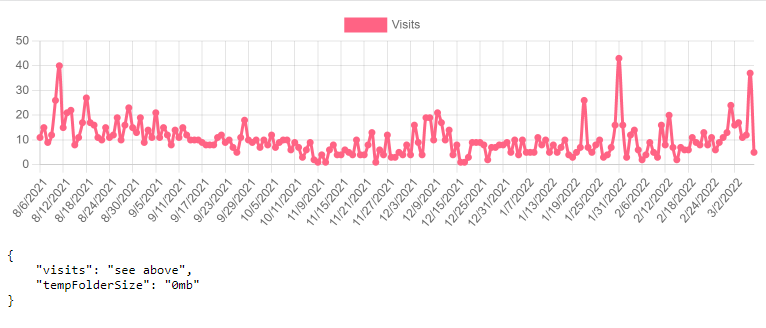

<div align="center">
	
	<br>
	<i>'track down' in Latin</i>
	<p>A very simple and lightweight visitor tracker middleware for Express.js servers.</p>
</div>

---

## Motivation

I needed an extremely simple way to visualize how many users visit my web apps, so I built this really simple drop-in middleware to do it. Services like gtag and segment are overkill sometimes.


# Installation
```bash
# Install using npm
npm install indago --save
# or yarn
yarn add indago
```

## Common Usage
```js
const http = require('http');
const express = require('express');
const Indago = require('indago');

const app = express();

const analyticsTracker = new Indago.Tracker({
	template: {
		// Custom analytics properties
		imageFolderSize: 0 // Example property
	},
	analyticsRoute: '/_debug', // Route to expose the analytics dashboard on.
	savePath: __dirname + '/analytics.json', // Path to save analytics data
	authentication: { // Defaults to false for no dashboard route authentication
		// Choose only one method of dashboard authentication:
		// 1. Username and Password
		username: 'root',
		password: 'securepassword123',

		// 2. Base64 Authentication Header Code
		base64: 'cm9vdDpzZWN1cmVwYXNzd29yZDMxMg=='
		// atob('cm9vdDpzZWN1cmVwYXNzd29yZDMxMg==') === 'root:securepassword312'

		// 3. Hex representation of a SHA256 Hash of Base64 Authentication Header Code
		hexHash: '68832558e77a2f66eb7703a4813b284fc49e086db75f232029ab269d0a494f55'
		// SHA256 Hash of 'cm9vdDpzZWN1cmVwYXNzd29yZDMxMg=='
	},
	// Called every 10 seconds
	onTick: async () => {
		if(Indago.Ticker('Update Image Folder Size', 5 * 60000)) { // Updates the image folder size every 5 minutes
			analyticsTracker.update({
				imageFolderSize: await getImageFolderSize()
			});
		}
	},
	// Called when a request is made to the debug route
	onDebugRequest: (req, res) => {},
});

app.use('/', analyticsTracker.middleware());

doSetupTask().then(async () => {
	await setupDatabaseOrSomethingSimilar();

	analyticsTracker.init();

	app.listen(3000, () => {
		console.log('listening on *:3000');
	});
}).catch(console.error);
```


## Dashboard

Then go to the route you've set to see the dashboard.

